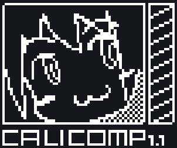

<div align="center">
  
  <h1>Kutu's dotfiles</h1>
  A <a href="http://waifubartending.com/">VA-11 HALL-A</a> and <a href="https://en.wikipedia.org/wiki/Neon_Genesis_Evangelion">NGE</a> inspired rice, using <a href="https://github.com/folke/tokyonight.nvim">Tokyo Night</a> theme. For developers & Power users with aesthetics, productivity and lightweight in mind. Powered by <a href="https://hyprland.org/">Hyprland</a>, <a href="https://github.com/davatorium/rofi">Rofi<a> and <a href="https://sw.kovidgoyal.net/kitty/">Kitty</a>.
</div>
&nbsp;

> **Warning**
> Although CALICOMP has been tested in different hardware without any trouble, it's a personal project and can have flaws, so feel free to contribute and open issues but use it at your responsibility.

## Installation
> **Warning**
> The install script is only compatible with Arch Linux and has been designed with clear installations in mind, the reliability in other environments is not insured. If you're using a different distro, please try to do a manual install.

This script with apply all the dotfiles, install the necessary package and make some tweaks to the system for improvements. It will also set up all the needed configurations for Nvidia graphics cards if you request it (Only for the ones compatible with the [nvidia](https://archlinux.org/packages/extra/x86_64/nvidia/) package).

```sh
$ git clone https://github.com/kutu-dev/dotfiles.git
$ cd dotfiles
$ ./install.sh
```

## Usage
### Hyprland shortcuts
| Command | Shortcut |
| - | - |
| Close window | `super + q` |
| Sign out | `super + shift + q` |
| Move focus left | `super + h` |
| Move focus right | `super + l` |
| Move focus up | `super + k` |
| Move focus down | `super + j` |
| Move to nº workspace | `super + nº` |
| Move window to nº workspace | `super + shift + nº` |
| Toggle floating window | `super + x` |
| Move floating window | `super + left click + move mouse` |
| Resize a window | `super + right click + move mouse` |
| Toggle fullscreen | `super + m` |
| Toggle fullscreen with gaps and topbar | `super + shift + m` |
| Toggle layouts | `super + y` |
| Toggle [gamemode](#gamemode) | `super + g` |
| Screenshot | `super + s` |
| Screenshot an area | `super + shift + s` |
| Screenshot and save to disk | `super + control + s` |
| Screenshot an area and save to disk | `super + control + shift + s` |
| Change random [wallpaper](#wallpapers) | `super + w` |
| Toggle [caffeine](#caffeine) | `super + f` |
| Lock screen | `super + o` |
| Open application launcher | `super + space` |
| Open window switcher | `alt + space` |
| Open quick actions menu | `control + space` |
| Open terminal | `super + t` |
| Open volume mixer | `super + b` |
| Open color picker | `super + c` |
| Open clipboard history | `super + v` |
| Open notification context menu (interact with it) | `super + n` |
| Toggle power menu | `super + p` |

### Waybar
The topbar is composed of:
- Workspace manager.
- [Wallpaper change button](#wallpapers).
- MPRIS status indicator.
    - Left click it to pause.
    - Right click to go to a Spotify window (if available).
    - Scroll up to go to the next song.
    - Scroll down to go to the previous song.
- [Caffeine status button](#caffeine).
- Package pending update counter. Click it to open a system update prompt.
    - **P**: Official Arch packages
    - **A**: AUR packages
    - **F**: Flatpak packages
- Audio and microphone volume percentage. Click it to open the volume mixer.
- Network status. Click it to open NetworkManager connection editor.
- Clock. Hover it to see the full date and time.
- Power button. Click it to toggle the power menu.

### Gamemode
Gamemode allows you to disable problematic shortcuts, remove the topbar and disable all the animations and effects to significantly improve the gaming experience of CALICOMP. You can enable it manually with a shortcut (`super + g`) or automatically using the wrapper command `gamemoderun` in your games (notice that this command is from the package [`gamemode`](https://archlinux.org/packages/extra/x86_64/gamemode/), so it will also optimize your hardware for better performance).

### Caffeine
Caffeine is a state of CALICOMP where the computer will always be awake (no auto lock screen or screen shutdown) even with no user input. You can activate it with a shortcut (`super + f`), with the power menu (`control + space`), or by clicking on the coffee icon at the [topbar](#waybar), here you can also see if it's enabled.

### Wallpapers
At this moment, when you change the wallpaper with a shortcut (`super + w`) or click the [topbar](#waybar) picture icon, a new one will be selected randomly from `~/pictures/wallpapers`. In the future, CALICOMP will come with a wallpaper manager tool that will allow you to have random wallpapers organized in different pools.

## Contributing
The `sync.sh` script will copy all the files that are supported by the `install.sh` script, because of this you can sync your dotfiles with the repository fast and clean. If you want to add more config files to the repository with paths non-compatible with the scripts, feel free to update them as well.

## Legal
This repository and all its content are not affiliated with [SUKEBAN GAMES](https://sukeban.moe/), [Nintendo](https://www.nintendo.com/), or any entity related to [Neon Genesis Evangelion](https://en.wikipedia.org/wiki/Neon_Genesis_Evangelion_(franchise)).

## Author
Created with :heart: by [Kutu](https://kutu-dev.github.io).
> - GitHub - [kutu-dev](https://github.com/kutu-dev)
> - Twitter - [@kutu_dev](https://twitter.com/kutu_dev)